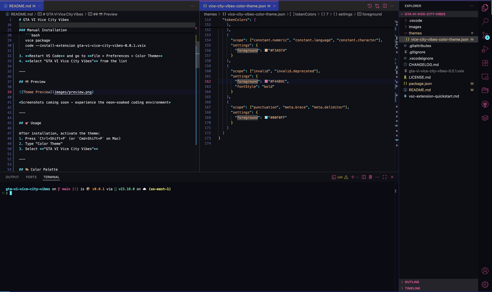

# GTA VI Vice City Vibes

A Miami Vice meets GTA VI aesthetic — neon cyan and magenta set against deep blues and blacks, perfect for immersive all-day/night coding.

---

## ✨ Features

- 🎨 **Neon-drenched Miami aesthetic** with vibrant cyan primary and tasteful magenta accents  
- 🕶️ Fully immersive theme: editor, panels, tabs, terminal & palettes all synced  
- 💡 **Simulated gradients and soft shadows** for visual depth and retro polish  
- ✅ Enhanced support for Command Palette, Quick Pick, input widgets, diffs, hover boxes, bracket matching

---

## 🚀 Installation

### Via VS Code Marketplace (Recommended)
1. Open VS Code
2. Go to Extensions (`Ctrl+Shift+X` or `Cmd+Shift+X` on Mac)
3. Search for "GTA VI Vice City Vibes"
4. Click **Install**
5. Restart VS Code and activate the theme

### Manual Installation
1. **Clone or download** this repo  
2. **Build and install** the theme:
   ```bash
   vsce package
   code --install-extension gta-vi-vice-city-vibes-0.0.1.vsix
   ```
3. **Restart VS Code** and go to **File > Preferences > Color Theme**
4. **Select "GTA VI Vice City Vibes"** from the list

---

## 📸 Preview



*Screenshots coming soon - experience the neon-soaked coding environment*

---

## 🎯 Usage

After installation, activate the theme:
1. Press `Ctrl+Shift+P` (or `Cmd+Shift+P` on Mac)
2. Type "Color Theme"  
3. Select **"GTA VI Vice City Vibes"**

---

## 🎨 Color Palette

| Element | Color | Hex |
|---------|-------|-----|
| Primary Cyan |  | `#00FFFF` |
| Magenta Accent |  | `#FF00FF` |
| Deep Blue |  | `#001122` |
| Rich Black |  | `#000811` |

---

## 🔧 Requirements

- Visual Studio Code 1.74.0 or higher
- For optimal experience: A monitor capable of displaying vibrant colors

---

## 🛠️ Supported Languages

This theme is optimized for all major programming languages including:
- JavaScript/TypeScript
- Python  
- HTML/CSS
- React/Vue/Angular
- Go, Rust, C++
- JSON, YAML, Markdown
- And many more...

---

## 🤝 Contributing

1. Fork this repository
2. Create your feature branch (`git checkout -b feature/amazing-feature`)
3. Commit your changes (`git commit -m 'Add amazing feature'`)
4. Push to the branch (`git push origin feature/amazing-feature`)
5. Open a Pull Request

### Development Setup
```bash
git clone https://github.com/swapsha96/gta-vi-vice-city-vibes.git
cd gta-vi-vice-city-vibes
npm install -g vsce
vsce package
```

---

## 📋 Changelog

See [CHANGELOG.md](CHANGELOG.md) for details on updates and version history.

---

## 📄 License

This project is licensed under the MIT License - see the [LICENSE.md](LICENSE.md) file for details.

---

## 🙏 Acknowledgments

- Inspired by the iconic Miami Vice aesthetic
- GTA VI's neon-soaked Vice City atmosphere  
- The retro-wave and synthwave communities

---

## 📞 Support

- 🐛 [Report bugs](https://github.com/swapsha96/gta-vi-vice-city-vibes/issues)
- 💡 [Request features](https://github.com/swapsha96/gta-vi-vice-city-vibes/issues)
- ⭐ Star this repo if you love the theme!

---

<div align="center">

**Dive into the neon-soaked code streets of Vice City** 🏙️✨

</div>
